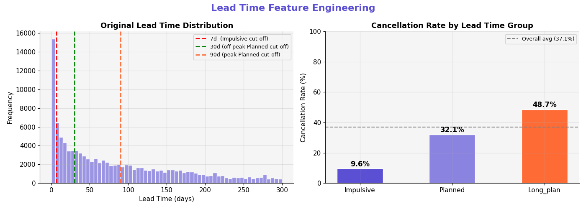
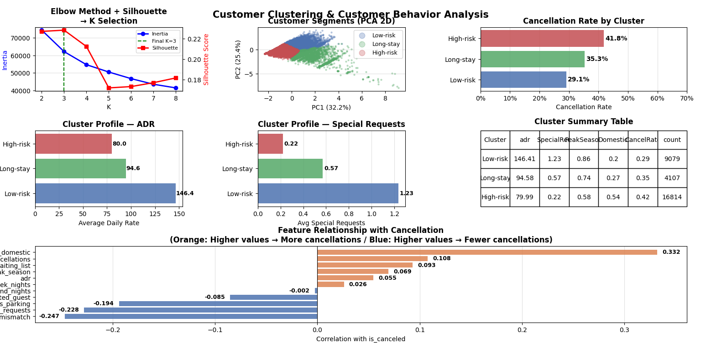

# Hotel Booking Cancellation Analysis

## 1. Project Overview

Predict hotel reservation cancellations and analyze customer behavior patterns.

The project follows an end-to-end data analytics pipeline:

* Exploratory Data Analysis (EDA)
* Feature Engineering
* Data Preprocessing
* Classification Modeling
* Customer Clustering
* Model Evaluation

Main objective:

* Predict booking cancellations
* Identify customer behavior patterns
* Propose business strategies for hotel revenue optimization

---

## 2. Dataset

Dataset source:
[Hotel Booking Demand Dataset (Kaggle)](https://www.kaggle.com/datasets/jessemostipak/hotel-booking-demand)

Dataset characteristics:

* Numerical + categorical features
* Missing values
* Outliers
* Highly skewed lead_time distribution

---

## 3. Pipeline

```text
EDA
→ Peak/Off-peak season analysis
→ Feature Engineering
→ Stratified Sampling
→ Encoding & Scaling
→ Classification
→ Clustering
→ Evaluation
```

---

## 4. Preprocessing

Main preprocessing steps:

* Missing value handling
* ADR outlier removal
* Peak season feature engineering
* lead_time_group generation
* Domestic/foreign customer conversion
* Family type categorization
* Stratified sampling (30,000 rows)
* One-Hot Encoding
* Robust Scaling

Generated features:

* peak_season
* lead_time_group
* family_type
* room_mismatch
* has_waiting_list
* has_parking
* is_domestic

Additional EDA script:

- preprocessing/peak_season.py  
  Used to analyze seasonal booking patterns and define peak/off-peak season criteria.

---

## 5. Classification

Models used:

* Logistic Regression
* Decision Tree
* Random Forest
* Bagging
* AdaBoost
* Gradient Boosting
* XGBoost

Evaluation metrics:

* Accuracy
* Precision
* Recall
* F1-score
* Stratified 5-Fold Cross Validation

---

## 6. Clustering

Clustering method:

* KMeans Clustering

Analysis methods:

* Elbow Method
* Silhouette Score
* PCA Visualization

Customer clusters:

* Low-risk
* Long-stay
* High-risk

---

## 7. Evaluation

Classification evaluation:

* Stratified 5-Fold CV
* Model comparison
* Feature importance analysis

Clustering evaluation:

* Inertia
* Silhouette Score
* PCA-based visualization


## Top 5 Model Combinations

The following ensemble model combinations achieved the highest predictive performance across customer clusters using Stratified 5-Fold Cross Validation.

| Rank | Model                   | Customer Cluster                      | Precision | Recall | F1-score |
| ---- | ----------------------- | ------------------------------------- | --------- | ------ | -------- |
| 1    | XGBoost                 | Cluster 2 (High-spending VIPs)        | 80.32%    | 84.33% | 82.27%   |
| 2    | Gradient Boosting       | Cluster 2 (High-spending VIPs)        | 80.50%    | 83.91% | 82.16%   |
| 3    | Soft Voting Ensemble    | Cluster 2 (High-spending VIPs)        | 79.01%    | 84.96% | 81.84%   |
| 4    | Random Forest (Bagging) | Cluster 2 (High-spending VIPs)        | 83.08%    | 77.68% | 80.28%   |
| 5    | Gradient Boosting       | Cluster 0 (Budget Personal Travelers) | 76.68%    | 77.48% | 77.05%   |

These results indicate that cluster-specific ensemble learning significantly improves cancellation prediction performance, particularly for high-risk customer segments.


---

## 8. Project Structure
```text
- dataset/
- preprocessing/
- modeling/
- results/
```

---

## 9. How to Run

1. Run preprocessing/preprocessing.py
2. Run modeling/classification.py
3. Run modeling/clustering.py





